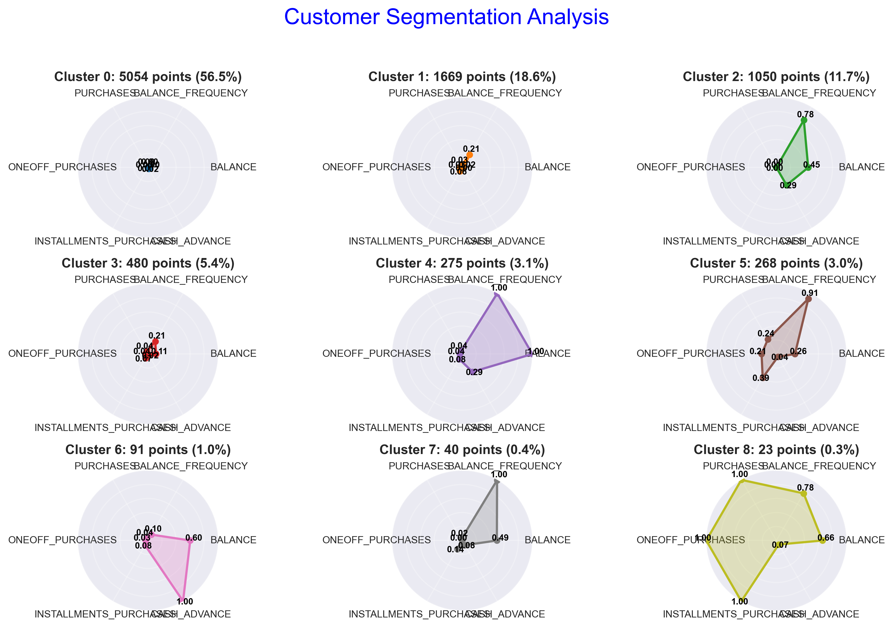

# Radar Chart Visualization Package

A comprehensive Python package for creating beautiful and customizable radar charts, particularly useful for cluster analysis and multi-dimensional data comparison.

## Quick Start

```python
import pandas as pd
import matplotlib.pyplot as plt
from cluster_radar import ClusterRadarChart

# Load your data
df = pd.read_csv('ccdata_with_clusters.csv')

# Create radar chart
radar = ClusterRadarChart(figsize=(12, 8))
fig = radar.create_cluster_radar_grid(
    data=df,
    title="Customer Segmentation Analysis",
    is_aggregated=False,
    cluster_col='final_cluster',
    id_cols=['CUST_ID'],
    max_features=6,
    save_path='radar_chart.png'
)
plt.show()
```

## Sample Output



## Installation

```bash
pip install numpy pandas matplotlib seaborn scikit-learn
```

## Usage

Run the example:
```bash
python run_example.py
```

## Features

- **Flexible Data Input**: Works with both raw data (with cluster labels) and pre-aggregated data
- **Automatic Processing**: Handles data aggregation, normalization, and feature selection automatically
- **Multiple Chart Types**: Single radar, comparison radar, grid layout, and advanced radar with special features
- **Extensive Customization**: Colors, styles, normalization methods, aggregation functions, and more
- **Professional Output**: High-quality charts suitable for presentations and publications

## Dependencies

- numpy
- pandas
- matplotlib
- seaborn
- scikit-learn